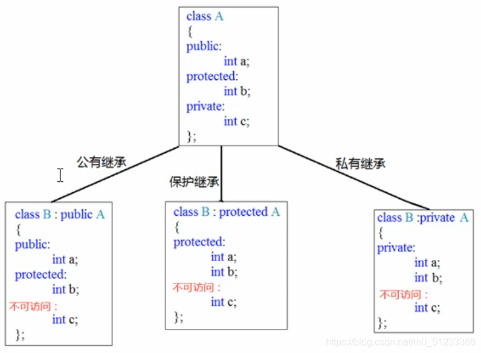
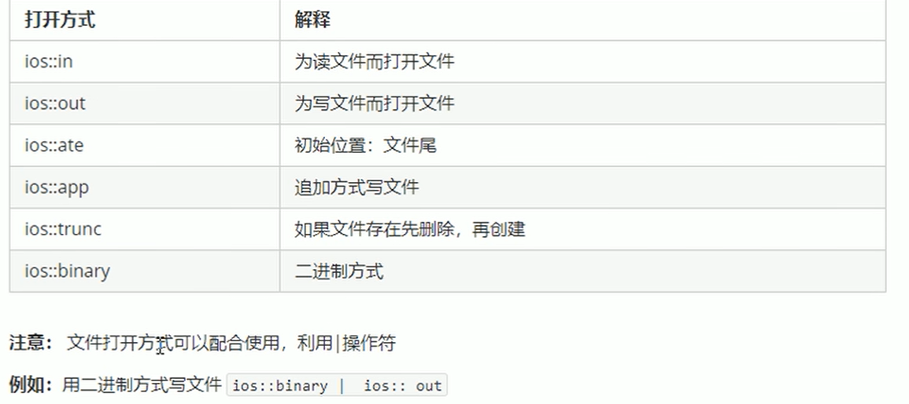
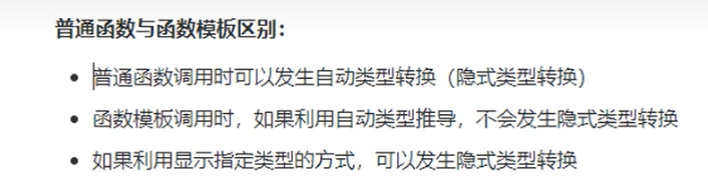
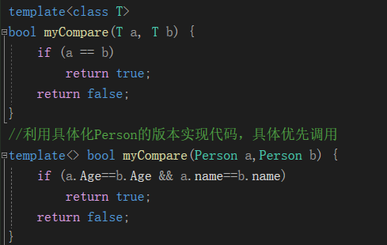
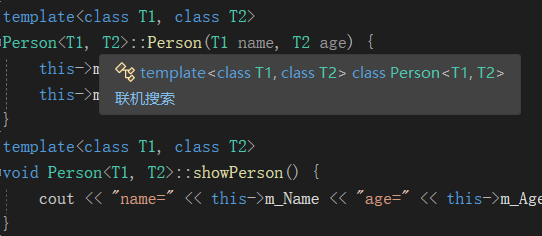
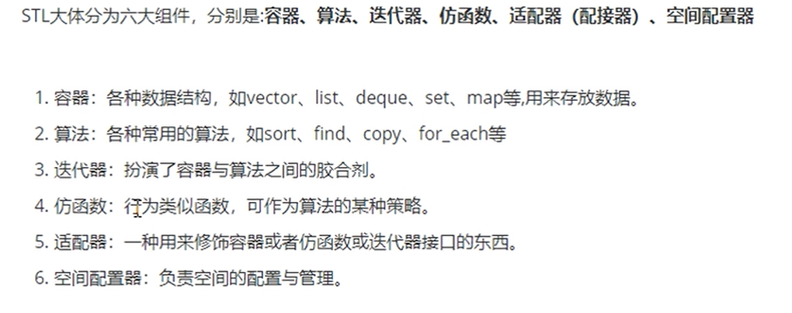
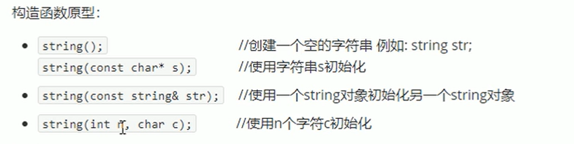
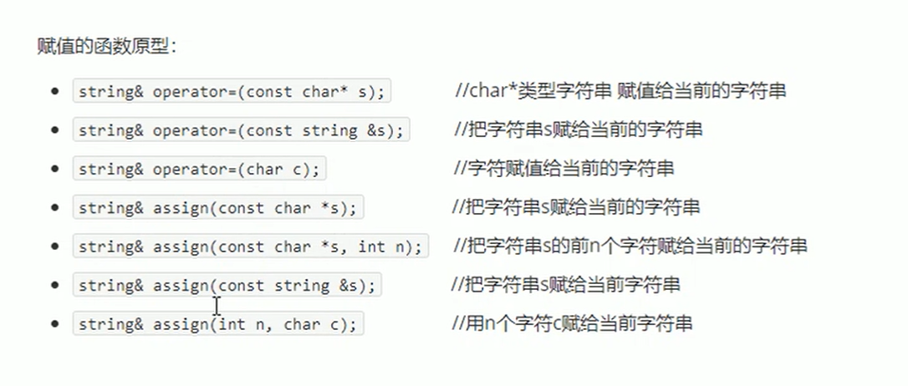
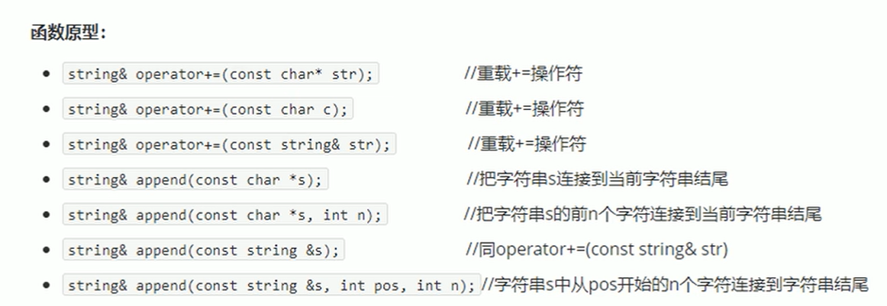
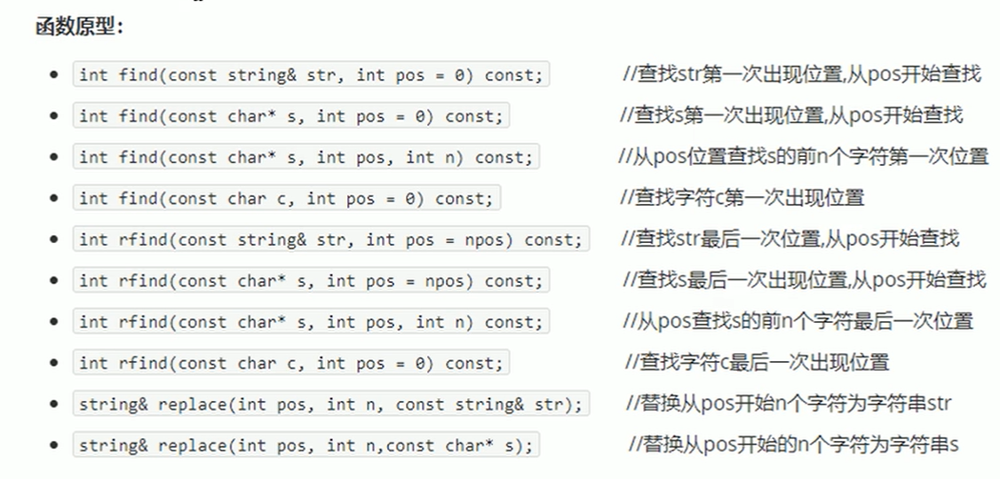

# C++学习

## 1.C++内存四区
* **代码区**：存放cpu执行的机器指令，由操作系统控制。代码区是共享的，只能读
* **全局区**：存放全局变量、静态变量、常量（字符串常量、全局常量），不存放局部变量，局部常量
* **栈区**：由编译器自动分配释放，存放函数的参数值、返回值、局部变量等。注：不要返回局部变量的地址，局部变量执行完后就被释放了
* **堆区**：堆区在内存中位于BSS区和栈区之间。一般由程序员分配和释放，若程序员不释放，程序结束时由操作系统回收。
  
## 2.类与对象

### （1）权限的区别
* **Public**：可以被该类中的函数、子类的函数、友元函数访问，也可以由该类的对象访问；
* **protected**：可以被该类中的函数、子类的函数、友元函数访问，但不可以由该类的对象访问；
* **private**：可以被该类中的函数、友元函数访问，但不可以由子类的函数、该类的对象、访问。<br><br>
  
  注：class定义的结构体默认是private,struct默认的是public

### （2）构造函数的调用
#### 1.括号法
	person p;//默认构造函数的调用
	person p2(10);//有参构造函数
	person p3(p2);
	注意事项1
	调用默认构造函数是，不要加()
	因为下面这行代码，编译器会认为是一个函数的声明,不会认为在创建对象
	person p();

### （3）深拷贝与浅拷贝问题
#### 浅拷贝是导致堆区重复释放，需要自己实现深拷贝来解决这个问题
```
class person{
public：
//自己实现拷贝构造函数 解决浅拷贝带来的问题
	person(const person& p) {
		m_age = p.m_age;
		cout << "person 拷贝构造函数调用" << endl;
		//m_height = p.m_height  浅拷贝:堆区的重复释放
		m_height = new int(*p.m_height);
	}
	~person() {
		//将堆区的开辟数据做释放操作
		if (m_height != NULL) {
			delete m_height;
			m_height = NULL;
		}
	int m_age;
	int* m_height;
```
### （4）指针和常量
* 指针常量(引用、this指针的本质)：指针的指向不能变，指针的值可以变
* 常量指针：指针的值不能变，指针的指向可以变
* 指向常量的常指针：指针的指向不能变，指针的值也不能变(const int const *p)

### （5）初始化列表初始化属性

    //初始化列表初始化属性
	person(int a,int b,int c) :m_a(a), m_b(b), m_c(c){

	}

### （6）类对象做为类成员
      当其他类对象作为本类成员，构造时先构造类对象，再构造自身,析构的顺序与构造相反。
    
### （7） 静态成员
#### 1）定义：成员变量和成员函数前面加上static
#### 2）静态成员变量
    class Person {
    public:
        /// <summary>
        /// 1.所有对象都共享同一份数据
        /// 2.编译阶段就分配内存
        /// 3.类内声明，类外初始化操作
        /// </summary>
        static int m_A;

        //静态成员变量也有访问权限
    private:
        static int m_B;
    };

    void testo2() {
	//静态成员变量 不属于某个对象上，所有对象都共享同一份数据
	//因此静态成员变量有两种访问方式
	//1.通过对象进行访问
	/*Person p;
	cout << p.m_A << endl;*/

	//2.通过类名进行访问
	cout << Person::m_A << endl;
	//cout << Person::m_B << endl;类外访问不到私有变量成员
    }
#### 3）成员变量和成员函数分开存储
    class Person {
        int m_A;//非静态成员变量 属于类的对象上（计算该类的大小的时候会被算上）
        static int m_B;//静态成员变量 不属于类的对象上};
        void func();//非静态成员函数 不属于类的对象上（每一个非静态成员函数只会诞生一份函数实例）
        static void func2();// 静态成员函数 不属于类的对象上
    };
**注：**
1. **静态成员变量**：静态成员变量实际上就是类域中的全局变量，必须初始化，且只能在类体外。静态成员变量属于类，不属于某个具体的对象。（即无论多少个对象，只分配一份内存）
2. **静态成员函数**：普通成员函数可以访问所有成员变量，而静态成员函数只能访问静态成员变量。**静态成员函数没有 this 指针**。


#### 4）this指针
    //1.解决名称冲突
    //2.返回对象本身用*this

#### 5）const修饰成员函数
    class Person {
    public:
        
        //this指针的本质时指针常量 指针的指向是不可以修改的
        //Person *const this;
        //在成员函数后面加const,修饰的时this指向，让指针指向的值也不可以修改
        //常函数
        void showperson() const//const Person* const this;
        {
            this->m_B = 100;
            //this->m_A = 100;
            //this = NULL;//this指针不可以修改指针指向
        }
        void func() {
            m_A = 100;
        }
        int m_A;
        mutable int m_B;//特殊变量，即使在常函数中，也可以修改这个值，加关键字mutable
    };
    void test01() {
        Person p;
        p.showperson();
    }

    //常对象

    void test02() {
        const Person p;//在对象前加const,变为常对象
        p.m_B = 100;//m_B时特殊值，在常对象也可以修改
        //常对象只能调用常函数
        p.showperson();
        //p.func();常对象 不可以调用普通成员函数，因为普通成员函数可以修改属性
    }
### （8） 友元
* 全局函数可以做友元
```
    class Building {
        //gooday全局函数时Building好朋友 ，可以访问building私有成员
        friend void gooday(Building* building);
    public:
        Building() {
            m_bedroom = "卧室";
            m_sittingroom = "客厅";
        }
    public:
        string m_sittingroom;
    private:
        string m_bedroom;
    };

    //全局函数
    void gooday(Building* building) {
        cout << "好基友全局函数 正在访问：" << building->m_sittingroom << endl;
        cout << "好基友全局函数 正在访问：" << building->m_bedroom << endl;
    }
```
* 类可以做友元
 ```
class Building;
class Goodday {
public:
	Goodday();
	void visit();//参观函数 访问Building中的属性
	Building* building;

};

class Building {
	friend class Goodday;
public:
	Building();
public:
	string m_Sitingroom;//客厅
private:
	string m_Bedroom;//卧室
};

//类外写成员函数
Building::Building() {
	m_Bedroom = "卧室";
	m_Sitingroom = "客厅";
}

Goodday::Goodday() {
	//创建建筑物对象
	building = new Building;
}
void Goodday::visit() {
	cout << "好基友类正在访问：" << building->m_Bedroom << endl;
}
  ```
* 成员函数可以做友元
```
class Building;
class Gooday {
public:
	Gooday();

	void visit();//让visit函数可以访问building中私有成员
	void visit2();//让visit2函数不可以访问building中私有成员

	Building* building;
};

class Building {
	//告诉编译器 Gooday类下的visit函数作为本类的好朋友，可以访问私有成员
	friend void Gooday::visit();
public:
	Building();
	string m_Sittingroom;
private:
	string m_Bedroom;
};
//类外实现成员函数
Building::Building() {
	m_Bedroom = "卧室";
	m_Sittingroom = "客厅";
}
Gooday::Gooday() {
	building = new Building;
}
void Gooday::visit() {
	cout << "visit函数正在访问： " << building->m_Sittingroom << endl;
	cout << "visit函数正在访问： " << building->m_Bedroom << endl;
}
void Gooday::visit2() {
	cout << "visit2函数正在访问： " << building->m_Sittingroom << endl;
}
```
### (9) 运算符重载
#### 1）加法运算法重载
* 成员函数重载+号
* 全局函数重载+号
####  2）左移运算符
* 全局函数重载<<号（链式编程思想，返回相同的输出类型）

#### 3）递增运算符
* 前置运算符：空参数，先加加，再返回本身（返回引用，一直对一个数据进行操作）
* 后置运算符：int占位来区分，先记录，再自加，再返回记录（返回值，因为局部变量已经释放再使用引用就是非法操作）
  
#### 4）赋值运算符（容易引起深浅拷贝的问题）
 用深拷贝来实现赋值操作
 ```
 	m_Age为指针变量

    //重载运算符
	Person &operator=(Person& p) {
		//编译器提供浅拷贝 m_Age = p.m_Age
		//应该先判断是否有属性在堆区，如果有先释放干净，再深拷贝
		if (m_Age != NULL) {
			delete m_Age;
			m_Age = NULL;
		}
		//深拷贝
		m_Age = new int(*p.m_Age);
		return *this;
	}
```

#### 5）关系运算符重载
自定义大小比较

#### 6）函数调用运算符重载 
由于使用起来非常类似于函数调用，因此称为仿函数（重载()）<br>
仿函数灵活，没有固定写法
```
class Myadd {
public:
	int operator()(int n1, int n2) {
		return n1 + n2;
	}
};
void MyPrint02(string test) {
	cout << test << endl;
}
void test01() {
	Myprint p;
	p("hello world");//由于使用起来非常类似于函数调用，因此称为仿函数（重载())
	MyPrint02("hello world");
}
```
注：
* 方式1/2/4（
```
* Test A;
Test test = Test();
// 很不常用的情况：利用对象指针；但在栈中分配内存
（本质和前面两种一样，不过多了一个对象指针来操作而已）
Test test1;
Test *test2 = &test1;
```
）：使用完后不需要手动释放，该类析构函数会自动执行
* 方式3（Test *test = new Test;
delete Test;）：new申请的对象，则只有调用到delete时再会执行析构函数，如果程序退出而没有执行delete则会造成内存泄漏。【new和delete必须配合使用】
### (8)继承
#### 1）基本语法(允许一个类继承多个类，直接后面加子类)
```
//继承实现页面
//公共页面类
class BasePage {
public:
		void header() {
			cout << "首页、公开课" << endl;
		}
		void footer() {
			cout << "帮助中心、交流合作、站内地图" << endl;
		}
		void left() {
			cout << "java、python、c++" << endl;
		}
};
class Java : public BasePage {
public:
	void content() {
		cout << "JAVA学科视频" << endl;
	}
};
```
#### 2）继承方式

```
class A {
	int al;//私有类型，只有在本类中使用。
protected:
	int a2;//受保护类型，用于本类和继承类调用。
public:
	int a3;//权限是最大的，可以内部调用，实例调用等。
};
```

#### 3）继承中的对象模型
* 父类中所有非静态成员属性都会被子类继承下去
* 父类中私有成员属性 是被编译器隐藏了，因此访问不到，但是确实被继承下去了

#### 4）继承中的构造和析构顺序
先构造父类再构造子类，析构的顺序和构造相反。

#### 5）同名成员处理
```
//同名成员属性
void test01() {
	son s;
	cout << "son下m_A= " << s.m_A << endl;
	//如果通过子类对象 访问到父类中同名成员，需要加作用域
	cout << "Base 下m_A= " << s.Base::m_A << endl;
}
//同名成员函数
void test02() {
	son s;
	s.func();//直接调用是子类中的同名成员
	s.Base::func();
	//如果子类中出现和父类同名的成员函数，子类的同名成员会隐藏掉父类中所有同名成员函数
	//如果想访问到父类中被隐藏的同名成员函数，需要加作用域
	s.Base::func(100);
}
```

#### 6）继承同名静态成员处理方式
  a. 通过对象访问
  ```
	son s;
	cout << "son 下m_A=" << s.m_A << endl;
	cout << "Base 下m_A=" << s.Base::m_A << endl;
	cout << endl;
```
b. 通过类名访问
```
cout << "通过类名访问：" << endl;
	cout << "son 下 m_A=" << son::m_A << endl;
	//第一个::代表通过类名访问 第二个::代表访问父类作用域下
	cout << "Base下m_A=" << son::Base::m_A << endl;
```

#### 7）菱形继承
```
class Animal {
public:
	int m_Age;
};
//利用虚继承 解决菱形继承的问题
// 在继承之前 加上关键字 virtual 变为虚继承
// Animal 变为虚基类
//羊类
class Sheep :virtual public Animal{};
//驼类
class Tuo:virtual public Animal{};
//羊驼类
class sheepTuo:public Sheep,public Tuo{};
void test01() {
	sheepTuo st;
	st.Sheep:: m_Age = 18;
	st.Tuo::m_Age = 28;
	//当菱形继承，两个父类拥有相同数据，需要加以作用域区分
	cout << "st.Sheep:: m_Age =" << st.Sheep::m_Age << endl;
	cout << "st.Tuo::m_Age = " << st.Tuo::m_Age << endl;
	cout << "st.m_Age=" << st.m_Age << endl;
	//菱形继承有两份，只要一份就可以了

}
```
### （9）多态
#### 1）条件：
有继承关系；子类重写父类的虚函数。
#### 2）分类：
* 静态多态：函数重载和运算符重载，复用函数名。**早绑定-编译阶段确定函数地址**
* 动态多态：派生类和虚函数实现运行时多态。**晚绑定-运行阶段确定函数地址**
#### 3）多态的使用
父类的指针或引用 指向子类对象
#### 4）多态的原理剖析
父类：vfptr(虚函数（表）指针)->vftable(虚函数地址)

子类：vfptr(虚函数（表）指针)->vftable(子类的虚函数地址)

当父类的指针或者引用指向子类对象时，发生多态。子函数虚函数表内部会替换成子类的虚函数地址

#### 5）纯虚函数和抽象类
纯虚函数语法：``virtual 返回值类型 函数名（参数列表）=0 ``

有了纯虚函数，这个类叫抽象类

抽象类特点：
* 无法实例化对象
* 子类必须重写抽象类的春旭函数，否则也属于抽象类
  

#### 6）虚析构和纯虚析构

二者共性：
* 可以解决父类指针释放子类对象
* 都需要有具体的函数实现

二者区别：
* 如果是纯虚析构，该类属于抽象类，无法实例化对象.

  
虚析构应用场景：父类在析构的时候 不会调用子类的析构函数，导致子类如果有堆区属性，出现内存泄漏的情况。没有堆区数据，可以不写为虚析构或纯虚析构

虚析构语法：virtual 析构函数<br>
纯虚析构语法：<br>
``virtual 析构函数=0；``<br>
``类名::~类名（）{}``

### （10）文件读写
#### 1）操作文件的三大类
* ofstream:写操作
* ifstream:读操作
* fstream:读写操作
  
#### 2）写文件
##### 1. 步骤
 * 包含头文件 fstream
 * 创建流对象ofstream ofs;
 * 打开文件 ofs.open("路径",打开方式)
 * 写数据 ofs<<"写入的数据”
 * 关闭文件 ofs.close()
  
##### 2.文件打开方式


#### 3）读文件
##### 1. 步骤
 * 包含头文件 fstream
 * 创建流对象ifstream ifs;
 * 打开文件 ifs.open("路径",打开方式)
 * 四种方式读取数据
 * 关闭文件 ifs.close()

#### 4）二进制写文件
* 打开方式指定为ios::out | ios::binary
* 函数原型：<br>
  ```ostream& write(const char *buffer,int len)```
* 解释：字符指针buffer指向内存一段存储空间。len是读写的字节数
  
#### 5）二进制读文件
*函数原型：<br>
```istream& read(char *buffer,int len)```

注：头文件应该只包含类的声明，而不是实现。实现部分应放在源文件中。这样做可以确保函数定义不会重复出现，从而避免链接错误。


## 3.模板
### 1）函数模板语法
函数模板作用：建立一个通用的函数，其函数返回值类型和形参类型可以不具体制定，用一个虚拟的类型来代表。
```
template<typename T>
函数声明或定义
```
**注**：
* 自动类型推导，必须推导出一致的数据类型T，才可以使用。
* 模板必须确定出T的类型，才可以使用。

### 2）普通函数模板和函数模板的区别


### 3）普通函数和函数模板的调用规则
1. 如果函数模板和普通函数都可以实现，优先调用普通函数
2. 可以通过空模板参数列表来强制调用函数模板
3. 函数模板也可以发生重载
4. 如果函数模板可以产生更好的匹配，优先调用函数模板

### 4）函数模板的局限性
传入的是两个数组或自定义类型，无法正常运行。
因此提供了函数模板的重载来解决这个问题。

## 4.类模板
### 1）语法
```
template<class T>
类
```
### 2）类模板和函数模板的却别
1. 类模板没有自动类型推导的使用方式,只能显示使用
2. 类模板在模板参数列表中可以有默认参数。
``` 
template<class NameType, class AgeType=int>
```

### 3）类模板中成员函数创建时机
1. 普通类中的成员函数一开始就可以创建
2. 类模板中的成员函数调用时才创建
   
### 4）类模板对象做函数参数
1. 指定传入的类型 -- 直接显示对象的数据类型
2. 参数模板化 -- 将对象中的参数变为模板进行传递
3. 整个类模板化 --将这个对象类型模板化进行传递
   
### 5）类模板与继承
当类模板碰到继承时，注意以下几点：
1. 当子类继承的父类是一个模板时，子类在声明的时候，要指定出父类中T的类型
2. 如果不指定，编译器无法给子类分配内存
3. 如果像灵活指定出父类中T的类型，子类也需变为类模板。
总结：如果父类是类模板，子类需要指定出父类中T的数据类型。


### 6）类模板成员函数类外实现



### 7）类模板分文件写
问：类模板中成员函数的创建时机实在调用阶段，导致分文件编写时链接不到
解决：
* 解决方式1：直接包含.cpp文件
* 解决方式2（**主流解决方式**）：将声明和实现写到同一个文件中，并更改后缀名为.hpp，hpp时约定俗称，不是强制。

### 8）类模板与友元
* 全局函数类内实现：直接在类内声明友元即可
* 全局函数类外实现：需要提前让编译器知道全局函数的存在
```
template<class T1, class T2>
class Person;
template<class T1, class T2>
void printPerson2(Person <T1, T2> p) {
	cout << "类外实现---name= " << p.m_Name << "  age=" << p.m_Age << endl;
}

template<class T1, class T2>
class Person {
	//全局函数类内实现
	friend void printPerson(Person <T1, T2> p) {
		cout << "name=" << p.m_Name << "age=" <<p.m_Age << endl;
	}
	//全局函数类外实现
	//如果全局函数是类外实现，需要让编译器提前知道
	friend void printPerson2<>(Person <T1, T2> p);
public:
	Person(T1 name, T2 age){
		this->m_Age = age;
		this->m_Name = name;
	}
private:
	T1 m_Name;
	T2 m_Age;
};
```
## 5.STL
### 1）六大组件


### 2）vector存放内置数据类型
容器：vector<br>
算法: for_each<br>
迭代器：vector<int>::iterator<br>
迭代器的三种用法：
```
//第一种
	//vector<int>::iterator ibegin = v.begin();//起始迭代器，指向容器中第一个元素
	//vector<int>::iterator iend= v.end();//结束...,指向容器中最后一个元素的下一个位置
	//while (ibegin!=iend) {
	//	cout << *ibegin << endl;
	//	ibegin++;
	//}
	//第二种
	/*for (vector<int>::iterator it = v.begin(); it != v.end(); it++) {
		cout << *it << endl;
	}*/
	//第三种
	for_each(v.begin(), v.end(),myPrint);
```

### 3） string容器
#### 1. string构造函数

#### 2. string赋值操作

#### 3.string字符串拼接

#### 4.string查找和替换

